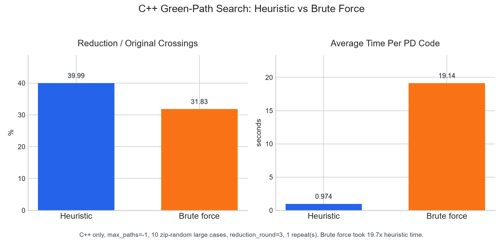

# cpp-pd-code-simplify

A dependency-free C++14 project for simplifying knot and link planar diagram
codes. The repository also includes a refactored Python prototype for
differential testing. User-facing tools first remove R1 moves and nugatory
crossings, then iteratively find and apply mid-simplification moves until the
configured round limit is reached or no further move is found.

## Quickstart

Build and test:

```sh
python tools/package.py test
```

Run one PD code:

```sh
./build/bin/pd_simplify --pd-code "PD[X[1,5,2,4],X[3,1,4,6],X[5,3,6,2]]"
```

On Windows, use `.\build\bin\pd_simplify.exe` for the executable path.
Add `--json` to get machine-readable output with `final_pd_code` and
`final_crossings`. Add `--verbose` to print progress logs to stderr, including
the current reduction round and crossing count.

Create a redistributable package with the CLI, shared library, headers, and
documentation:

```sh
python tools/package.py package --run-tests
```

Run the Python prototype:

```sh
python mid_simplify_v5.py --pd-code "PD[X[1,5,2,4],X[3,1,4,6],X[5,3,6,2]]"
```

Install and use the Python C++ interface package:

```sh
pip install cpp-pd-code-simplify-interface
python -m cpp_pd_code_simplify_interface "PD[]"
```

The package compiles a cached local dynamic library on first use, so a C++14
compiler must be available. From Python:

```python
import cpp_pd_code_simplify_interface as simplify

result = simplify.simplify("PD[]")
print(result["final_pd_code"])
```

Run C++/Python differential tests:

```sh
python -m venv .venv
.\.venv\Scripts\python -m pip install -r requirements-dev.txt
.\.venv\Scripts\python tools\compare_cpp_python.py --include-reference
```

On Linux and macOS, use `.venv/bin/python` instead of
`.\.venv\Scripts\python`.

## Benchmark Snapshot

Original lightweight benchmark:


Zip-random large-case benchmark:


C++ heuristic versus brute-force search on the zip-random large cases:



This local run uses the deterministic benchmark set documented in
[Benchmarking](docs/benchmarking.md). The lightweight suite is measured with
strict `--reduction-round -1`; the large zip-random throughput chart uses
`--reduction-round 3` because terminal brute-force stability proofs can be
very expensive on 120-150 crossing diagrams.

## Documentation

- [Command-line interface](docs/cli.md)
- [Python prototype and comparison tools](docs/python.md)
- [Python C++ interface package](docs/python-interface.md)
- [Algorithm and correctness](docs/algorithm-and-correctness.md)
- [Heuristic path sampling](docs/heuristic-path-sampling.md)
- [Packaging](docs/packaging.md)
- [Benchmarking](docs/benchmarking.md)
- [Python and C++ comparison results](docs/python-cpp-comparison.md)

## Acknowledgements

The algorithm and the original `mid_simplify_v5.py` prototype were implemented
by [zzhouhe](https://github.com/zzhouhe), also available on Bilibili at
[space.bilibili.com/37877654](https://space.bilibili.com/37877654). This
project does not claim original algorithmic contributions; it ports that
algorithm to C++ and adds command-line tooling, documentation, tests,
benchmarks, and component-accounting infrastructure around the port.

## Notes

Plain PD codes cannot encode components with no crossings. Both the C++ and
Python implementations expose component-accounting APIs and CLI options so
that crossingless components are counted explicitly instead of being lost.

## Citation

If you use this project, please cite it as:

```bibtex
@misc{cpp_pd_code_simplify_2026,
  author = {{GGN-2015}},
  title = {{cpp-pd-code-simplify}: A C++ Port of a PD-Code Mid-Simplification Algorithm},
  year = {2026},
  url = {https://github.com/GGN-2015/cpp-pd-code-simplify},
  note = {The underlying algorithm and original Python prototype were implemented by zzhouhe.}
}
```
