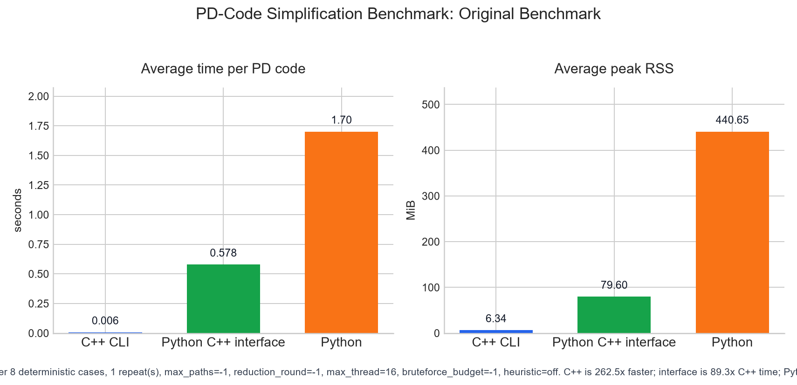
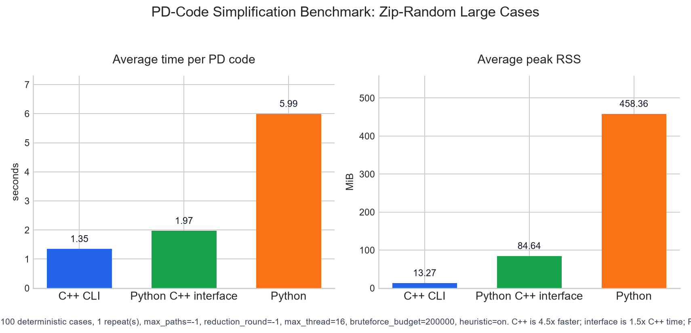

# cpp-pd-code-simplify

A dependency-free C++17 project for simplifying knot and link planar diagram
codes. The repository also includes a refactored Python prototype for
differential testing. User-facing tools first remove R1 moves, true R2 bigons,
and nugatory crossings, then iteratively find and apply mid-simplification
moves until the configured round limit is reached or no further move is found.

## Quickstart

Build and test:

```sh
python tools/package.py test
```

Run one PD code:

```sh
./build/bin/pd_simplify --pd-code "PD[X[1,5,2,4],X[3,1,4,6],X[5,3,6,2]]"
```

On Windows, use `.\build\bin\pd_simplify.exe` for the executable path.
Add `--json` to get machine-readable output with `final_pd_code` and
`final_crossings`. Add `--verbose` to print progress logs to stderr, including
the local timestamp, current reduction round, crossing count, and the
`actual_threads` selected when `--max-thread -1` enters brute-force search.
Add `--timeout K` to cap each PD-code job at `K` seconds; the default `-1`
means no timeout. Timed-out jobs still return the best PD code found so far
and set `timed_out` in the JSON/text result. Brute-force green-path search is
streamed instead of cached; `--bruteforce-budget N` caps brute-force green-path
checks per PD code, defaulting to `200000`, and `-1` disables that cap. A
budget stop still returns the current best PD code and sets
`resource_limited`. Add `--show-step-pd` to print the PD code after each
applied mid-simplification witness; it writes to stdout and is disabled by
default. Add `--log-file FILEPATH` to tee everything written to stdout and
stderr into a flushed backup log file.

Create a redistributable package with the CLI, shared library, headers, and
documentation:

```sh
python tools/package.py package --run-tests
```

Run the Python prototype:

```sh
python mid_simplify_v5.py --pd-code "PD[X[1,5,2,4],X[3,1,4,6],X[5,3,6,2]]"
```

Install and use the Python C++ interface package:

```sh
pip install cpp-pd-code-simplify-interface
python -m cpp_pd_code_simplify_interface "PD[]"
```

The package compiles a cached local dynamic library on first use, so a C++17
compiler must be available. On Windows, use a 64-bit MinGW-w64/UCRT, Clang, or
MSVC-compatible compiler for 64-bit Python; legacy MinGW.org toolchains are not
supported. The interface caches non-system compiler runtime libraries beside
that dynamic library when needed. From Python:

```python
import cpp_pd_code_simplify_interface as simplify

result = simplify.simplify("PD[]")
print(result["final_pd_code"])
```

All final `final_pd_code` strings are normalized for display: each crossing is
written from the under-incoming edge, labels are renumbered along oriented
components from `1`, crossing rows are sorted lexicographically, and the
simplification algorithms keep their internal numbering unchanged.

Run C++/Python differential tests:

```sh
python -m venv .venv
.\.venv\Scripts\python -m pip install -r requirements-dev.txt
.\.venv\Scripts\python tools\compare_cpp_python.py --include-reference
```

On Linux and macOS, use `.venv/bin/python` instead of
`.\.venv\Scripts\python`.

## Benchmark Snapshot

Original lightweight benchmark:



| Engine | Avg Time / PD Code (s) | Peak RSS (MiB) |
| --- | ---: | ---: |
| C++ CLI | 0.006480 | 6.344 |
| Python C++ interface | 0.578396 | 79.598 |
| Python | 1.700927 | 440.652 |

Zip-random large-case benchmark:



| Engine | Avg Time / PD Code (s) | Peak RSS (MiB) |
| --- | ---: | ---: |
| C++ CLI | 1.346003 | 13.270 |
| Python C++ interface | 1.970066 | 84.641 |
| Python | 5.994071 | 458.363 |

This local run uses the deterministic benchmark set documented in
[Benchmarking](docs/benchmarking.md). The lightweight suite is measured with
`--max-paths -1 --ban-heuristic --reduction-round -1 --max-thread 16
--bruteforce-budget -1`. The large zip-random throughput chart uses one
hundred active zip-random cases with `--max-paths -1 --reduction-round -1
--max-thread 16 --bruteforce-budget 200000`; the benchmark checks C++ CLI,
Python C++ interface, and Python outputs for exact JSON agreement in the same
batch-mode run that measures time and peak RSS.

## Documentation

- [Command-line interface](docs/cli.md)
- [Python prototype and comparison tools](docs/python.md)
- [Python C++ interface package](docs/python-interface.md)
- [Algorithm and correctness](docs/algorithm-and-correctness.md)
- [Heuristic path sampling](docs/heuristic-path-sampling.md)
- [Packaging](docs/packaging.md)
- [Benchmarking](docs/benchmarking.md)
- [C++ zip-random time analysis](docs/cpp-time-analysis.md)
- [Python and C++ comparison results](docs/python-cpp-comparison.md)

## Acknowledgements

The algorithm and the original `mid_simplify_v5.py` prototype were implemented
by [zzhouhe](https://github.com/zzhouhe), also available on Bilibili at
[space.bilibili.com/37877654](https://space.bilibili.com/37877654). This
project does not claim original algorithmic contributions; it ports that
algorithm to C++ and adds command-line tooling, documentation, tests,
benchmarks, and component-accounting infrastructure around the port.

## Notes

Plain PD codes cannot encode components with no crossings. Both the C++ and
Python implementations expose component-accounting APIs and CLI options so
that crossingless components are counted explicitly instead of being lost.

## Citation

If you use this project, please cite it as:

```bibtex
@misc{cpp_pd_code_simplify_2026,
  author = {{GGN-2015}},
  title = {{cpp-pd-code-simplify}: A C++ Port of a PD-Code Mid-Simplification Algorithm},
  year = {2026},
  url = {https://github.com/GGN-2015/cpp-pd-code-simplify},
  note = {The underlying algorithm and original Python prototype were implemented by zzhouhe.}
}
```
