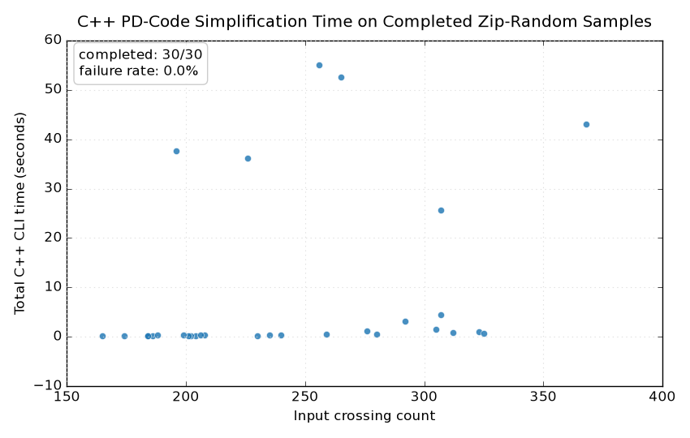

# C++ Zip-Random Time Analysis

This page records a C++-only timing experiment on PD codes sampled from
`tests/pd_code.zip`. The zip file itself is a local test fixture and is
not committed to the repository.

## Method

- Sample size: `30` PD-code files.
- Random seed: `20260709`.
- C++ executable: `build/bin/pd_simplify.exe`.
- Runtime options: `--max-paths -1 --reduction-round -1 --max-thread 16 --bruteforce-budget 200000`.
- Per-case timeout: `120` seconds. Timed-out, resource-limited, or errored cases are counted as failures and excluded from the scatter plot.
- Each point is one C++ CLI invocation, so the time includes process startup, parsing, preprocessing, simplification, and final JSON formatting.
- Generated at local time `2026-07-10 12:40:25` on `Windows-11-10.0.26100-SP0` with Python `3.13.1`.

## Results

| Metric | Value |
| --- | ---: |
| Sampled cases | 30 |
| Completed cases | 30 |
| Failed cases | 0 |
| Failure rate | 0.0% |
| Crossing count range | 165 to 368 |
| Median crossing count | 232.5 |
| Total completed C++ time | 4.47 min |
| Mean completed time | 8.939 s |
| Median completed time | 0.455 s |
| Max completed time | 54.985 s |

Raw artifacts:

- [CSV rows](assets/cpp_zip_random_30_time_scatter.csv)
- [JSON results](assets/cpp_zip_random_30_time_scatter.json)
