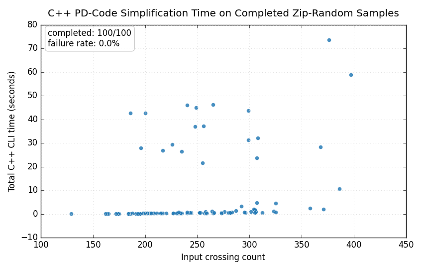
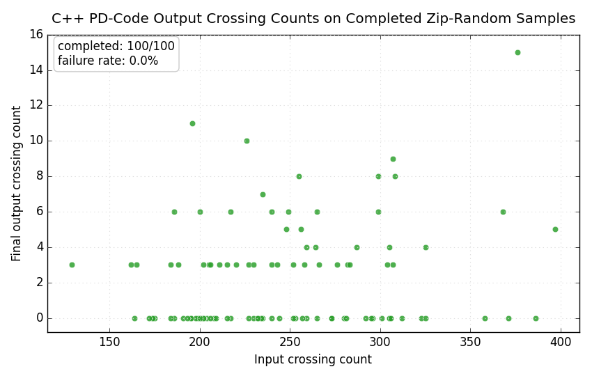

# C++ Zip-Random Time Analysis

This page records a C++-only timing experiment on PD codes sampled from
`tests/pd_code.zip`, the committed zip-random corpus fixture.

## Method

- Sample size: `100` PD-code files.
- Random seed: `20260709`.
- C++ executable: `build/bin/pd_simplify.exe`.
- Runtime options: `--max-paths -1 --reduction-round -1 --max-thread 16 --bruteforce-budget 200000`.
- Per-case timeout: `120` seconds. Timed-out, resource-limited, or errored cases are counted as failures and excluded from the scatter plot.
- Each point is one C++ CLI invocation, so the time includes process startup, parsing, preprocessing, simplification, and final JSON formatting.
- Generated at local time `2026-07-10 23:04:20` on `Windows-11-10.0.26100-SP0` with Python `3.13.1`.

## Results

### Runtime

### Crossing Reduction

The second scatter plot uses the original input crossing count as the
horizontal axis and the final crossing count reported by the completed
algorithm run as the vertical axis.

| Metric | Value |
| --- | ---: |
| Sampled cases | 100 |
| Completed cases | 100 |
| Failed cases | 0 |
| Failure rate | 0.0% |
| Crossing count range | 129 to 397 |
| Median crossing count | 240.0 |
| Total completed C++ time | 13.05 min |
| Mean completed time | 7.831 s |
| Median completed time | 0.441 s |
| Max completed time | 1.23 min |

Raw artifacts:

- [CSV rows](assets/cpp_zip_random_100_time_scatter.csv)
- [JSON results](assets/cpp_zip_random_100_time_scatter.json)
